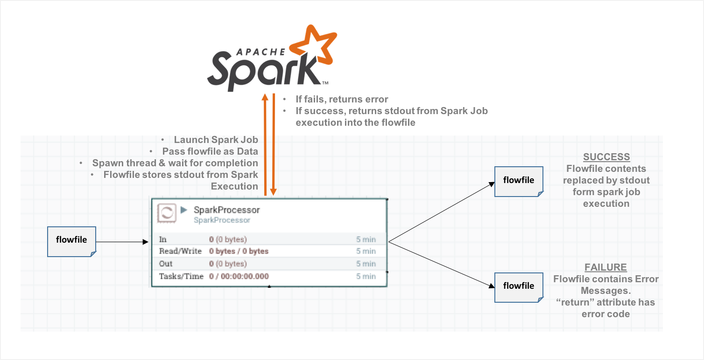
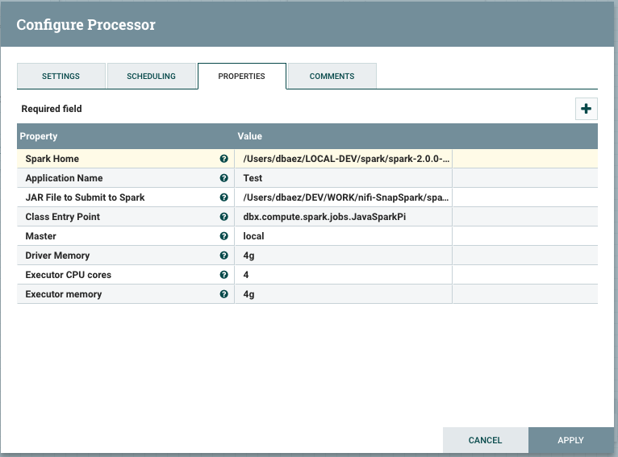
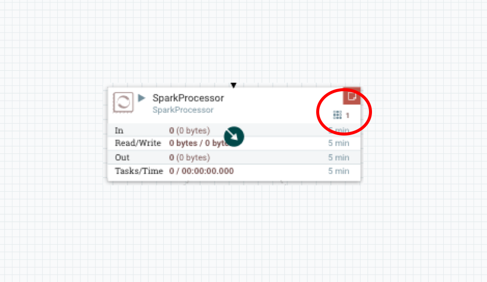

# NiFi-SnapSpark
*Custom NiFi Processor to launch Ephemeral Jobs in Spark*

This custom NiFi processor was implemented to provide an easy way to launch **Ephemeral** Spark Jobs as part of a NiFi flow. 

Ephemeral means that we do not know the state of Spark before, during, or after the invocation, we just care that the job was submitted, executed and results came back, no state of any type is kept.  Data, or reference to data, is passed in the invocation, and the results captured and stored in the flowfile. 

The best use case for this processor is when you want to launch ephemeral jobs for processing in Spark with a predictable start and finish cycles, rather than long running jobs. Since the processor will launch-and-wait for spark to finish, it means a thread will be allocated to wait until spark returns, no interaction happens while the Spark job is running. 

## High Level Flow

This is – by design - not a tight integration between NiFi and Spark, but rather a light and efficient mechanism to leverage Spark processing power:  Job is submitted to spark, processor launches a thread to wait for the results to return, results of the spark job execution in the flowfile; of course full provenance is kept. 

If the spark invocation was successful, output from the spark job is captured and stored in the flowfile. In case of an unsuccessful launch, the error messages are stored in the flowfile, the error code is used to populate the **”return” attribute**, and the FAIL event will be generated.

## Invocation

The processor has eight Properties which need to be set for successful launch:

1.	**Spark Home**: Location of spark installation
2.	**Application Name**: Identifier for the launching application or flow
3.	**JAR name**: jar file containing the job to be launched in spark
4.	**Class Entry Point**: The entry point for your application, the name of the class to be invoked in the JAR file (--class)
5.	**Master**: The [master URL]( http://spark.apache.org/docs/latest/submitting-applications.html#master-urls) for the cluster (--master)
6.	**Driver Memory**:  Memory for the driver(DRIVER_MEMORY)
7.	**Executor CPU Cores**: (--total-executor-cores)
8.	**Executor Memory**: (--executor-memory)

Once the processor is activated, you will see a thread allocated to the processing which will stay active until the spark job has completed:

## Components & Implementation

The implementation is done in Java, and structured as a maven project. The processor has two main components and a testing jar, represented in the tree structure:

1. **spark-launcher**: Classes which will launch the Spark Job. Stand-alone module.
2. **nifi-spark-connector-bundle**: the nifi custom processor. Uses the spark-launcher.
3. **spark-job**: jobs to be launched by Spark for testing. Stand-alone module.

## Install and Building

I was not able to find a clean way to build from top to bottom using maven since the nifi-processor has to have a certain structure, and I am using a custom deployed spark launcher. Here is the order that **MUST** be followed to be able to deploy successfully:

1.	Build spark-launcher: 
•	cd to *NiFi-SnapSpark/spark-launcher* directory
•	execute `mvn clean install`
•	this creates a jar file: **target/spark-launcher-0.0.1.jar**
2.	Manually install the spark-launcher jar into the nifi processor repository:
•	cd to *NiFi-SnapSpark/nifi-sparkconnector-bundle*
•	Execute script to install jar: `./installSPARK-LAUNCHER`
•	This installs the spark-launcher jar into the nifi processor repository
3.	Build nifi-processor:
•	In directory *NiFi-SnapSpark/nifi-sparkconnector-bundle*
•	execute `mvn install`
4.	Build sample job classes:
•	cd to NiFi-SnapSpark/spark-job
•	execute `mvn install`
5.	Install new processor into the NiFi:
•	Go to the NiFi installation directory. cd *<NIFI_INSTALLATION_DIR>/lib*
•	Copy the nar file just built: cp *<REPO_DIR>/nifi-sparkconnector-bundle/nifi-sparkconnector-nar/target/nifi-sparkconnector-nar-0.0.1.nar *<NIFI_INSTALLATION_DIR>/lib/*
6.	Restart NiFi

## Caveats

*	I have tested the custom processor with many spark job classes and all seems to work well, but by no means have I done a fully comprehensive and thorough testing of all spark capabilities
*	The only “odd” behavior was during very long running jobs; since you do not know the status while it is running, I found it a bit frustrating. This is however the same behavior you experience using spark-submit from the command line. Perhaps monitoring the spark progress and placing it into the NiFi log would be a nice addition. 
*	Maven structure could be automated so you could do a top level `mvn install` and it should automatically install the spark-launcher jar in the right place, without the need to manually install it. I was unable to get it to work properly.

